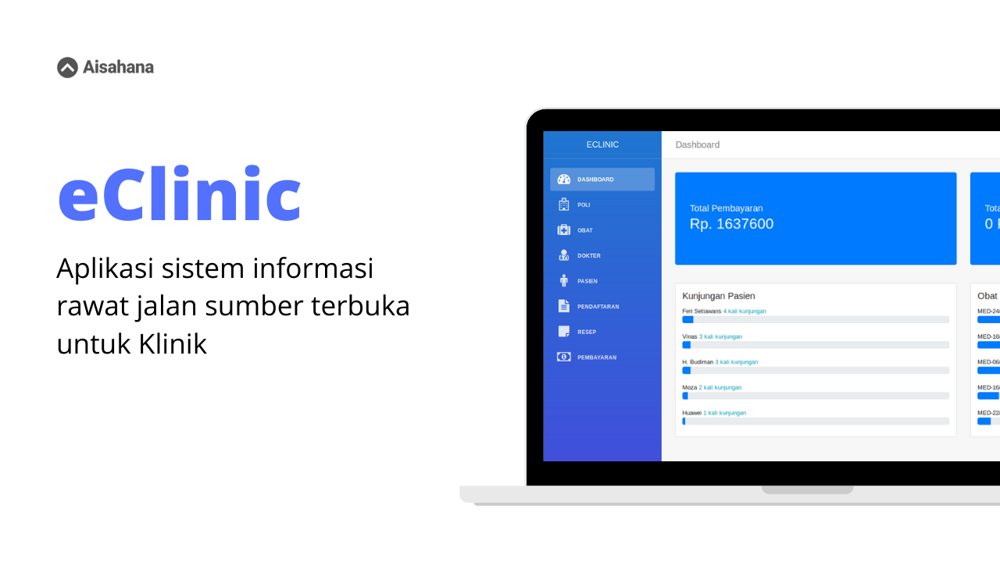

## eClinic API

Ini adalah API untuk eClinic. eClinic adalah aplikasi sistem informasi
rawat jalan sumber terbuka untuk klinik.

### Admin Panel
Karena aplikasi ini membutuhkan Admin, Admin eClinic bisa Anda dapatkan [disini](https://github.com/aisahana/eclinic_admin).

### Quick Setup
Clone repo ini lalu jalankan perintah:

```
$ pip install -r requirements.txt
$ python manage.py migrate
$ python manage.py createsuperuser
$ python mana.py runserver
```

Setelah selesai, jalankan development server:

```
$ python manage.py runserver
```

API telah siap digunakan dengan mengakses:

```
http://localhost:8000
```

## Demo
Anda bisa melihat demonya 
[disini](https://www.youtube.com/playlist?list=PLq10xSDEwzczYJ3luDICP2JbM9I7A0rmK).


